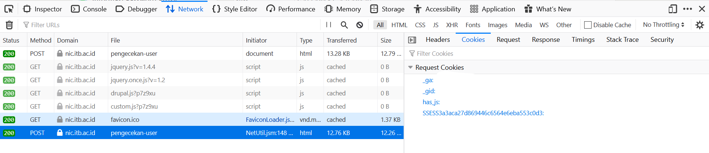

# ITB Single-Threaded NIM Scrapper
An ordinary scrapper which was created by Ryan Daniel from [NIC ITB](nic.itb.ac.id)

## Description
This scrapper is using single-threaded process using Python to get student's NIM and name only (It's actually up to you). The result will be post to Realtime Firebase Database in each iteration.

## Prerequisities
Please do the following steps before doing the scrapping:
1. Install Python 3 and the latest version of pip.
2. Install the libraries needed using command line:
```
pip install firebase_admin
pip install requests
pip install PyQuery
```
3. Create your Firebase Realtime Database.
4. Generate your Admin SDK private key and put the file to your project location.
5. Paste the configuration snippet to your code.
```
import firebase_admin
from firebase_admin import credentials

cred = credentials.Certificate("path/to/serviceAccountKey.json")
firebase_admin.initialize_app(cred)
```
## Getting the Cookies
1. Open your browser, hit ```Ctrl + Shift + I``` and open network.
2. Click cookies as image below.



3. Copy the cookies.
## Running the Main Program
2. Change #TODO on nimScrapper.py to make it functional because I censored personal data like my database URL and also useless expired cookies.
    
3. Open your command line and type:
```
python nimScrapper.py
```
4. The process takes around 3 hours so you can ~~re-evaluate your life while waiting~~ start making the NIM finder application(if you want to).

## Database Structure
- Root
  - (faculty_code)
    - (year)
      - data
        - {name: 'Ryan Daniel', tpb: '16518142', jurusan: '13518130'}
        - ...more

## Credits
Special thanks to [mkamadeus](https://github.com/mkamadeus/) who helped me making this scrapper. He made one too using multi-threading and MySQL database. You can visit his repository [here](https://github.com/mkamadeus/Python-ITB-NIM-Scraper).

## Final Words
If you need my database for academic purpose, please contact my LINE [here](https://line.me/ti/p/ryndnlp).